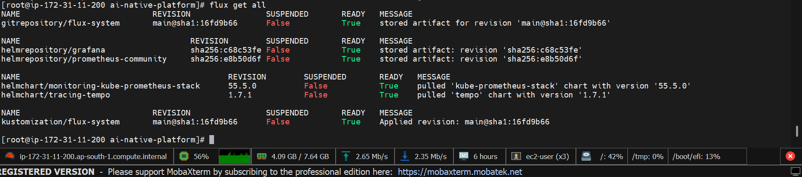
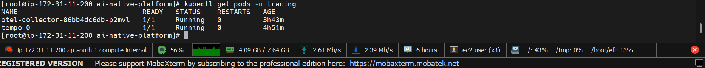

# 🚀 AI-Native Platform
## DevOps → SRE → AIOps → MLOps → LLMOps (Production-Style Architecture)

A fully GitOps-driven AI-native Kubernetes platform integrating:

- ☸ Kubernetes Infrastructure
- 🔄 GitOps (FluxCD)
- 📊 Observability (Prometheus + Grafana + OpenTelemetry + Tempo)
- 🛡️ SRE Practices (SLOs, Error Budgets, Autoscaling)
- 🤖 AIOps (Anomaly Detection + Remediation)
- 🧠 MLOps (Model Training & Serving)
- 🔥 LLMOps (LLM Telemetry + Token Monitoring)
- ☁ AWS Deployment

This project demonstrates how modern AI workloads should be operated in production environments.

---

# 🏗 High-Level Architecture

Infrastructure → GitOps → Platform Services → Applications → Observability → AI Automation

All deployments are Git-driven and automatically reconciled.

# 🖼 Architecture Diagram

            ┌────────────────────────────┐
            │        Git Repository       │
            │  (GitOps Source of Truth)   │
            └──────────────┬──────────────┘
                           │
                           ▼
                    ┌──────────────┐
                    │    FluxCD    │
                    │ Reconciler   │
                    └──────┬───────┘
                           ▼
             ┌───────────────────────────┐
             │      Kubernetes Cluster   │
             │                           │
             │  Apps   |   AI   |  LLM   │
             │                           │
             └─────────┬─────────────────┘
                       ▼
        ┌─────────────────────────────────┐
        │ Observability Stack             │
        │ Prometheus | Grafana | Tempo    │
        └─────────────────────────────────┘
                       ▼
            ┌───────────────────────┐
            │ AIOps & MLOps Engine  │
            └───────────────────────┘

---

# 📂 Repository Structure

## 📦 Repository Structure

---

# ☸ Kubernetes Cluster State

All services deployed declaratively via GitOps.

---

# 🔄 GitOps Continuous Delivery (FluxCD)

Git is the single source of truth.

- Any commit → Automatically deployed
- Drift detection enabled
- Self-healing workloads

---

# 📊 Observability Stack

## Prometheus Targets

All workloads scraped using ServiceMonitor.

---

## LLM Telemetry Metrics

Tracked metrics:

- llm_requests_total
- llm_tokens_total
- llm_request_latency_seconds

---

# 📈 Grafana Dashboard

Custom dashboard visualizing:

- Request Rate
- Token Consumption
- Latency Distribution
- Node Resource Metrics

---

# 🔍 Distributed Tracing (OpenTelemetry + Tempo)

Tracing enabled through OTEL Collector and Tempo.

- End-to-end trace visibility
- Latency analysis
- Request flow inspection

---

# 📡 LLM Metrics (Inside Pod)

Metrics exposed via `/metrics` endpoint.

---

# 🤖 AIOps Layer

## Model Training

Trigger:

POST /train

---

## Anomaly Detection

Trigger:

POST /detect

Example output:

This enables automated anomaly detection for production workloads.

---

# 🛡️ SRE Layer

Located in:

sre/
├── slos/
├── error-budgets/
├── autoscaling/
└── chaos/

Implements:

- Service Level Objectives
- Error Budget policies
- Horizontal Pod Autoscaler
- Chaos engineering scenarios

Ensures system reliability under load.

---

# 🧠 MLOps Layer

mlops/
├── training/
├── pipelines/
├── model-registry/
└── serving/

Capabilities:

- Automated retraining
- Model validation
- Versioned deployments
- Metrics-driven rollback

---

# 🔥 LLMOps Layer

llmops/
├── rag/
├── prompt-versioning/
├── vector-db/
└── llm-serving/

Features:

- Token tracking
- Prompt version management
- LLM latency monitoring
- Production telemetry for generative AI

---

# 🔐 CI/CD

ci/
├── github-actions/
└── security-scans/

Includes:

- Docker build pipeline
- Security image scanning
- GitOps deployment automation

---

# 🚀 Deployment Flow

1. Provision infrastructure (Terraform)
2. Bootstrap Kubernetes cluster
3. Install FluxCD
4. Push manifests to Git
5. Flux reconciles workloads
6. Prometheus scrapes metrics
7. Grafana visualizes telemetry
8. AIOps detects anomalies
9. MLOps retrains model
10. LLMOps monitors generative workloads

---

# 🎯 Production Capabilities Demonstrated

✅ GitOps-driven infrastructure  
✅ Full observability pipeline  
✅ AI-powered anomaly detection  
✅ ML lifecycle automation  
✅ LLM telemetry tracking  
✅ Kubernetes production architecture  

---

# 🛠 Technology Stack

- Kubernetes
- FluxCD
- Prometheus
- Grafana
- OpenTelemetry
- Tempo
- FastAPI
- Python
- Docker
- Terraform
- AWS

---

# 👤 Author

Bhaskar Sharma  
DevOps | SRE | MLOps | AI Infrastructure Engineer  

---

