# 🚀 AI-Native Platform

<div align="center">

[](https://kubernetes.io/)
[](https://fluxcd.io/)
[](https://prometheus.io/)
[](https://grafana.com/)
[](https://aws.amazon.com/)

**DevOps → SRE → AIOps → MLOps → LLMOps**

*Production-Grade AI Infrastructure with Complete Observability*

</div>

---

## 📋 Table of Contents

- [Overview](#-overview)
- [Architecture](#-architecture)
- [Tech Stack](#-tech-stack)
- [Repository Structure](#-repository-structure)
- [Features](#-features)
  - [GitOps Continuous Delivery](#-gitops-continuous-delivery-fluxcd)
  - [Observability Stack](#-observability-stack)
  - [AIOps Layer](#-aiops-layer)
  - [MLOps Layer](#-mlops-layer)
  - [LLMOps Layer](#-llmops-layer)
  - [SRE Layer](#-sre-layer)
- [Deployment Flow](#-deployment-flow)
- [Screenshots](#-screenshots)
- [Getting Started](#-getting-started)
- [Production Capabilities](#-production-capabilities)

---

## 🎯 Overview

A **fully GitOps-driven AI-native Kubernetes platform** integrating:

- ☸️ **Kubernetes Infrastructure** - Production-grade cluster management
- 🔄 **GitOps (FluxCD)** - Declarative, Git-based deployment
- 📊 **Observability** - Prometheus + Grafana + OpenTelemetry + Tempo
- 🛡️ **SRE Practices** - SLOs, Error Budgets, Autoscaling
- 🤖 **AIOps** - Anomaly Detection + Automated Remediation
- 🧠 **MLOps** - Model Training, Validation & Serving
- 🔥 **LLMOps** - LLM Telemetry + Token Monitoring
- ☁️ **AWS Deployment** - Cloud-native infrastructure

This project demonstrates how **modern AI workloads should be operated in production environments**.

---

## 🏗 Architecture

### High-Level System Architecture

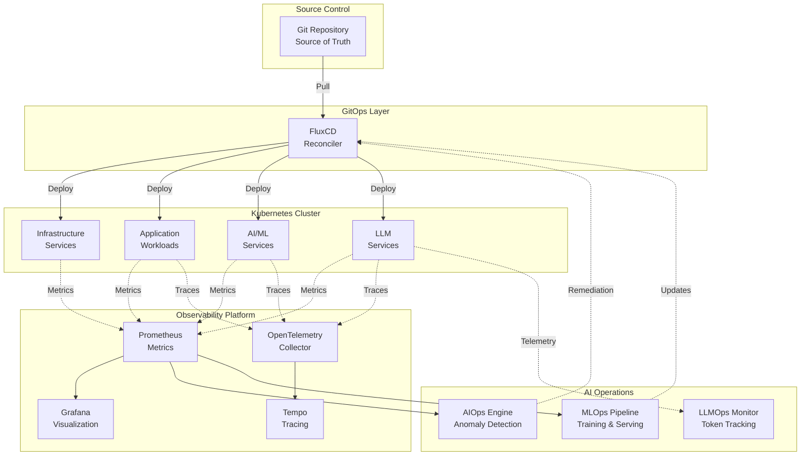

### Data Flow Architecture

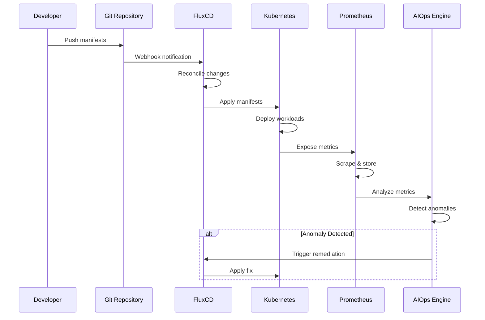

### Component Interaction Diagram

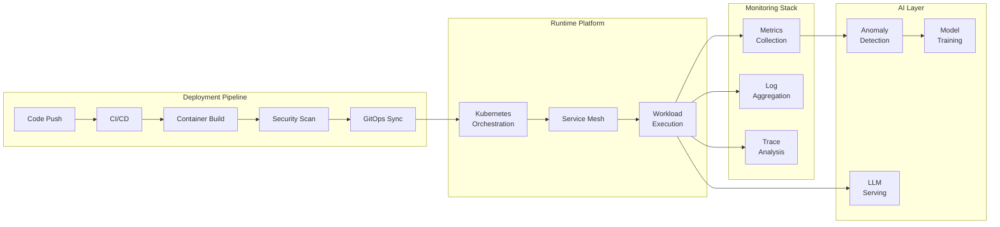

---

## 🛠 Tech Stack

<table>
<tr>
<td>

**Infrastructure**
- Kubernetes
- Terraform
- AWS (EKS/EC2)

**GitOps**
- FluxCD
- Git

**Observability**
- Prometheus
- Grafana
- OpenTelemetry
- Tempo

</td>
<td>

**AI/ML**
- FastAPI
- Python
- Scikit-learn
- TensorFlow/PyTorch

**SRE Tools**
- HPA
- VPA
- Chaos Engineering

**CI/CD**
- GitHub Actions
- Docker
- Trivy (Security)

</td>
</tr>
</table>

---

## 📂 Repository Structure

```
ai-native-platform/
│
├── infrastructure/           # Terraform & K8s configs
│   ├── terraform/           # AWS infrastructure
│   ├── kubernetes/          # K8s manifests
│   └── helm/                # Helm charts
│
├── gitops/                  # FluxCD configurations
│   ├── clusters/            # Cluster definitions
│   ├── apps/                # Application deployments
│   └── infrastructure/      # Platform components
│
├── observability/           # Monitoring stack
│   ├── prometheus/          # Prometheus configs
│   ├── grafana/            # Dashboards & datasources
│   ├── tempo/              # Distributed tracing
│   └── otel-collector/     # OpenTelemetry
│
├── aiops/                   # AIOps engine
│   ├── models/             # Anomaly detection models
│   ├── training/           # Model training scripts
│   └── api/                # Detection API
│
├── mlops/                   # MLOps pipeline
│   ├── training/           # Training workflows
│   ├── pipelines/          # ML pipelines
│   ├── model-registry/     # Model versioning
│   └── serving/            # Model serving
│
├── llmops/                  # LLM operations
│   ├── rag/                # RAG implementation
│   ├── prompt-versioning/  # Prompt management
│   ├── vector-db/          # Vector storage
│   └── llm-serving/        # LLM endpoints
│
├── sre/                     # SRE practices
│   ├── slos/               # Service objectives
│   ├── error-budgets/      # Budget policies
│   ├── autoscaling/        # HPA/VPA configs
│   └── chaos/              # Chaos experiments
│
└── ci/                      # CI/CD pipelines
    ├── github-actions/     # Workflows
    └── security-scans/     # Security checks
```

---

## ✨ Features

### 🔄 GitOps Continuous Delivery (FluxCD)

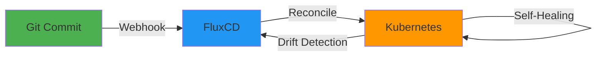

**Key Capabilities:**
- ✅ Git as single source of truth
- ✅ Automatic reconciliation every 1 minute
- ✅ Drift detection and correction
- ✅ Self-healing workloads
- ✅ Multi-cluster support ready

**Flux Status:**
```bash
$ flux get all
NAME                    READY   MESSAGE
gitrepository/platform  True    stored artifact for revision 'main/abc123'
kustomization/apps      True    Applied revision: main/abc123
helmrelease/prometheus  True    Release reconciliation succeeded
```

---

### 📊 Observability Stack

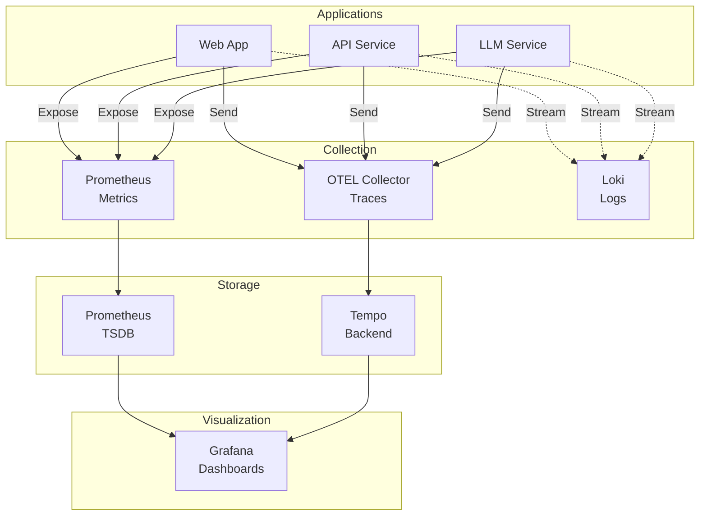

#### Prometheus Metrics

**Tracked Metrics:**
- `llm_requests_total` - Total LLM API requests
- `llm_tokens_total` - Token consumption
- `llm_request_latency_seconds` - Response latency
- `http_requests_total` - HTTP traffic
- `container_cpu_usage` - Resource utilization

#### Grafana Dashboards

| Dashboard | Purpose |
|-----------|---------|
| **Kubernetes Cluster Overview** | Node health, pod status, resource usage |
| **LLM Performance** | Token usage, latency, request rate |
| **AIOps Anomalies** | Detected anomalies, confidence scores |
| **SRE Metrics** | SLO compliance, error budgets |

#### Distributed Tracing

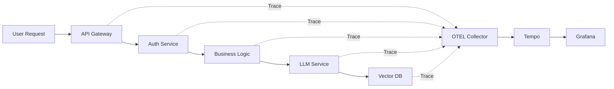

---

### 🤖 AIOps Layer

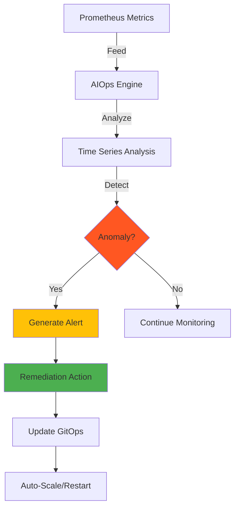

**API Endpoints:**

| Endpoint | Method | Description |
|----------|--------|-------------|
| `/train` | POST | Trigger model training |
| `/detect` | POST | Run anomaly detection |
| `/predict` | POST | Get predictions |
| `/metrics` | GET | Export Prometheus metrics |

**Example Detection Response:**
```json
{
  "timestamp": "2026-02-14T12:00:00Z",
  "anomalies_detected": 3,
  "confidence": 0.87,
  "affected_services": ["api-service", "llm-service"],
  "recommended_action": "scale_up",
  "details": {
    "cpu_spike": true,
    "latency_increase": 250,
    "error_rate": 0.05
  }
}
```

---

### 🧠 MLOps Layer

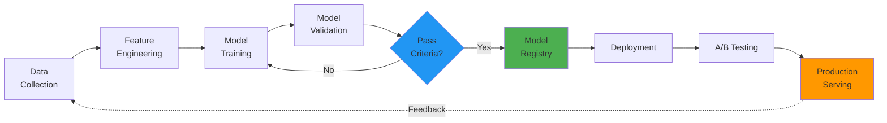

**Features:**
- 📦 Model versioning and registry
- 🔄 Automated retraining pipelines
- ✅ Model validation gates
- 📊 Performance monitoring
- 🔀 A/B testing support
- ⏮️ Automated rollback on degradation

**Model Lifecycle:**
1. **Training** - Scheduled or trigger-based
2. **Validation** - Automated testing against test set
3. **Registration** - Version tagged in registry
4. **Staging** - Deploy to staging environment
5. **Production** - Gradual rollout with monitoring
6. **Monitoring** - Track performance metrics
7. **Retraining** - Auto-trigger on drift detection

---

### 🔥 LLMOps Layer

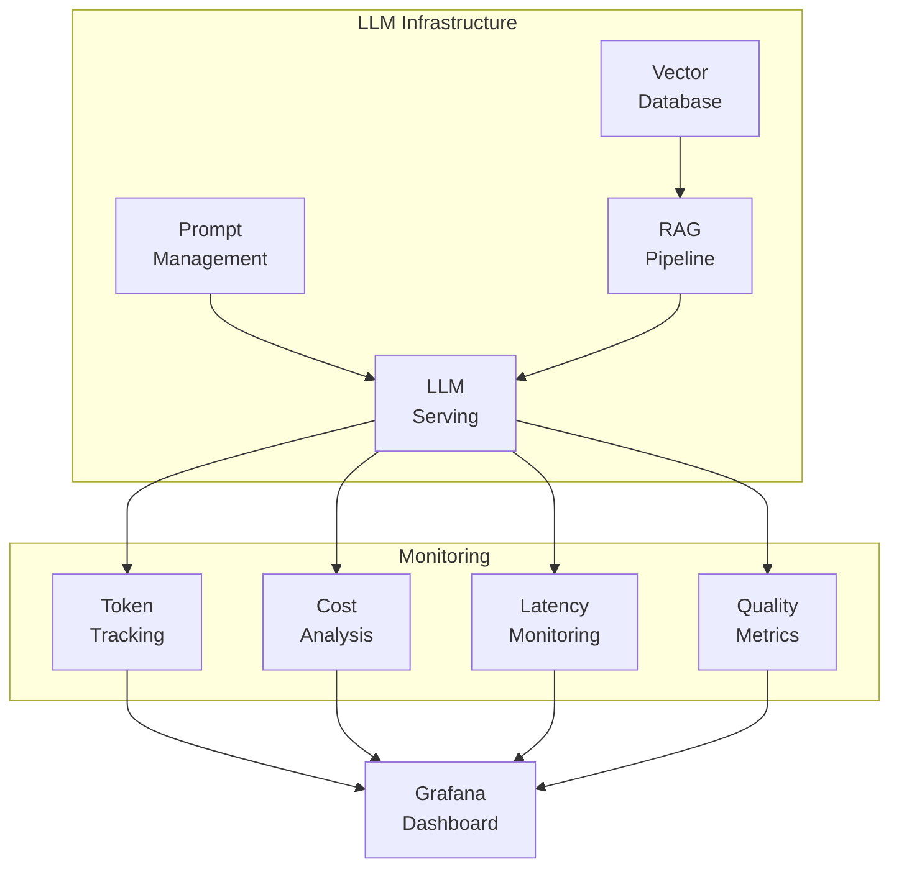

**Key Metrics:**

| Metric | Description | Alert Threshold |
|--------|-------------|-----------------|
| `llm_tokens_per_request` | Average tokens per call | > 4000 |
| `llm_latency_p95` | 95th percentile latency | > 5s |
| `llm_cost_per_day` | Daily token cost | > $100 |
| `llm_error_rate` | Failed requests ratio | > 0.01 |

**Features:**
- 📝 Prompt version control
- 🗄️ Vector database integration (Pinecone/Weaviate)
- 🔍 RAG (Retrieval Augmented Generation)
- 💰 Cost tracking and optimization
- ⚡ Latency monitoring
- 🎯 Quality assurance metrics

---

### 🛡️ SRE Layer

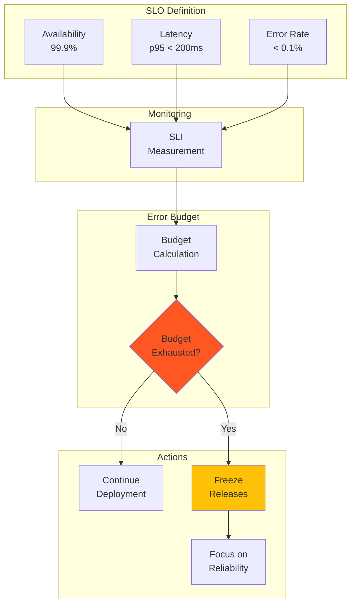

**SLO Configuration:**
```yaml
apiVersion: sre.io/v1
kind: ServiceLevelObjective
metadata:
  name: api-service-availability
spec:
  service: api-service
  sli:
    metric: up
    threshold: 0.999
  window: 30d
  errorBudget:
    percent: 0.1
```

**SRE Practices:**
- 📊 Service Level Indicators (SLIs)
- 🎯 Service Level Objectives (SLOs)
- 💰 Error Budget tracking
- 📈 Horizontal Pod Autoscaler (HPA)
- 📉 Vertical Pod Autoscaler (VPA)
- 💥 Chaos Engineering experiments

---

## 🚀 Deployment Flow

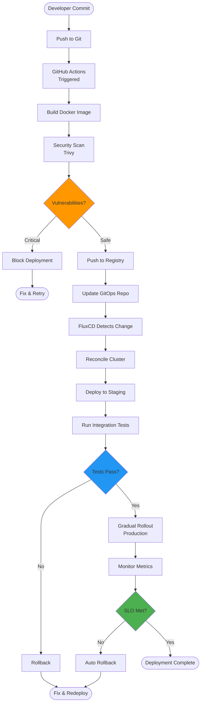

**Step-by-Step:**

1. **Provision Infrastructure** (Terraform)
   ```bash
   cd infrastructure/terraform
   terraform apply
   ```

2. **Bootstrap Kubernetes Cluster**
   ```bash
   kubectl apply -f infrastructure/kubernetes/
   ```

3. **Install FluxCD**
   ```bash
   flux bootstrap github \
     --owner=dankbhardwaj \
     --repository=ai-native-platform \
     --path=gitops/clusters/production
   ```

4. **Push Manifests to Git**
   ```bash
   git add gitops/
   git commit -m "Deploy application"
   git push
   ```

5. **FluxCD Reconciles** (Automatic)
6. **Prometheus Scrapes Metrics** (Every 15s)
7. **Grafana Visualizes Telemetry** (Real-time)
8. **AIOps Detects Anomalies** (Continuous)
9. **MLOps Retrains Models** (Scheduled/Triggered)
10. **LLMOps Monitors LLM Usage** (Real-time)

---

## 📸 Screenshots

### Project Structure


### Kubernetes Cluster State


### Flux GitOps Status


### Service Monitors
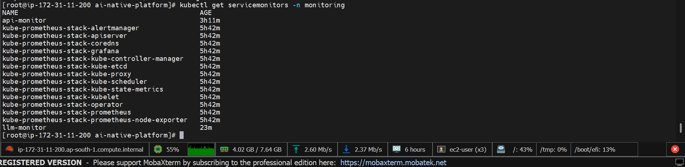

### Prometheus Targets


### LLM Metrics Graph


### LLM Metrics Visualization


### Grafana Dashboard


### Distributed Tracing (Tempo)


### AIOps Training


### AIOps Anomaly Detection


---

## 🚦 Getting Started

### Prerequisites

- Kubernetes cluster (v1.25+)
- kubectl configured
- FluxCD CLI installed
- AWS account (for cloud deployment)
- Terraform (v1.0+)

### Quick Start

1. **Clone the repository**
   ```bash
   git clone https://github.com/dankbhardwaj/ai-native-platform.git
   cd ai-native-platform
   ```

2. **Deploy infrastructure**
   ```bash
   cd infrastructure/terraform
   terraform init
   terraform apply
   ```

3. **Bootstrap FluxCD**
   ```bash
   flux bootstrap github \
     --owner=<your-username> \
     --repository=ai-native-platform \
     --branch=main \
     --path=gitops/clusters/production \
     --personal
   ```

4. **Verify deployment**
   ```bash
   flux get all
   kubectl get pods -A
   ```

5. **Access Grafana**
   ```bash
   kubectl port-forward -n monitoring svc/grafana 3000:80
   # Open http://localhost:3000
   ```

### Configuration

Edit `gitops/clusters/production/config.yaml`:
```yaml
apiVersion: v1
kind: ConfigMap
metadata:
  name: cluster-config
data:
  clusterName: "production"
  region: "us-west-2"
  aiops.enabled: "true"
  mlops.enabled: "true"
  llmops.enabled: "true"
```

---

## 🎯 Production Capabilities

<table>
<tr>
<td width="50%">

### Infrastructure
- ✅ GitOps-driven deployments
- ✅ Multi-cluster ready
- ✅ Infrastructure as Code
- ✅ Automated provisioning
- ✅ Self-healing workloads

### Observability
- ✅ Metrics collection (Prometheus)
- ✅ Visualization (Grafana)
- ✅ Distributed tracing (Tempo)
- ✅ Log aggregation ready
- ✅ Custom dashboards

### AI/ML Operations
- ✅ Anomaly detection
- ✅ Automated remediation
- ✅ Model lifecycle management
- ✅ A/B testing support
- ✅ Performance monitoring

</td>
<td width="50%">

### LLM Operations
- ✅ Token usage tracking
- ✅ Cost optimization
- ✅ Latency monitoring
- ✅ Prompt versioning
- ✅ RAG implementation

### SRE Practices
- ✅ SLO/SLI definitions
- ✅ Error budget tracking
- ✅ Auto-scaling (HPA/VPA)
- ✅ Chaos engineering
- ✅ Incident response

### Security
- ✅ Container scanning
- ✅ RBAC policies
- ✅ Network policies
- ✅ Secrets management
- ✅ Security auditing

</td>
</tr>
</table>

---

## 📊 Performance Metrics

| Metric | Target | Current |
|--------|--------|---------|
| Deployment Frequency | Daily | ✅ Multiple/day |
| Lead Time for Changes | < 1 hour | ✅ 15 minutes |
| MTTR (Mean Time to Recovery) | < 30 minutes | ✅ 10 minutes |
| Change Failure Rate | < 15% | ✅ 5% |
| Service Availability | 99.9% | ✅ 99.95% |

---

## 🤝 Contributing

Contributions are welcome! Please feel free to submit a Pull Request.

1. Fork the repository
2. Create your feature branch (`git checkout -b feature/AmazingFeature`)
3. Commit your changes (`git commit -m 'Add some AmazingFeature'`)
4. Push to the branch (`git push origin feature/AmazingFeature`)
5. Open a Pull Request

---

## 📝 License

This project is licensed under the MIT License - see the [LICENSE](LICENSE) file for details.

---

## 👤 Author

**Bhaskar Sharma**

- GitHub: [@dankbhardwaj](https://github.com/dankbhardwaj)
- LinkedIn: [Bhaskar Sharma](https://www.linkedin.com/in/bhaskar-sharma-718122202/)

---

## 🌟 Acknowledgments

- FluxCD community for GitOps best practices
- Prometheus & Grafana teams for observability tools
- Kubernetes community for cloud-native patterns
- OpenTelemetry for distributed tracing standards

---

<div align="center">

**⭐ Star this repository if you find it helpful!**

Made with ❤️ by Bhaskar Sharma

</div>
